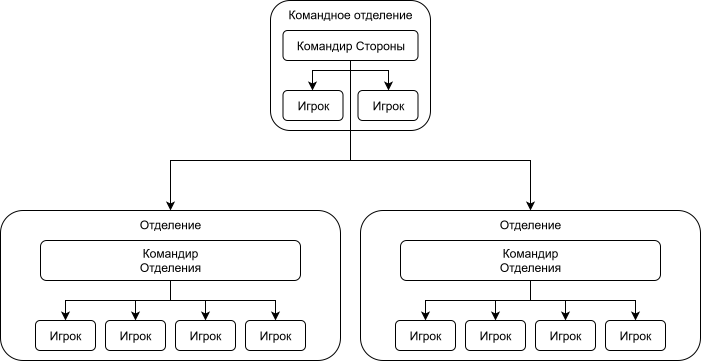

# В этом документе собраны полезные сведения о структуре и иерарихии сервера.

## Иерархия

Во время игры, на сервере действует следующая иерархия игроков (при достаточном кол-ве игроков)

Т.е. командир стороны также является командиром своего отделения, и командиром для других отделений.

Командир отделения является командиром для всего своего отделения.

## Роли

На каждой миссии есть различные слоты, соответсвующие своим ролям. Название каждого слота соответсвует его снаряженю и тактической цели.

Например, Пулемётчик - пехотинец, оснащённый пулемётом, а Марксман - стрелок с марксманской или снайперской винтовкой.

## Отряды

На проекте введена система отрядов. Отряд - это группа игроков, обычно с назначеным командиром, которые отдельно от остальных игроков могут проводить тренировки, участвовать в играх в одном отделении, пользуясь преймуществом своей подготовки. В зависимости от численности, отряд может занимать от части отделения до нескольких. Полный перечень отрядов можно найти в канале [Ротация](https://discord.com/channels/1342566079465132143/1428836733050552470).
